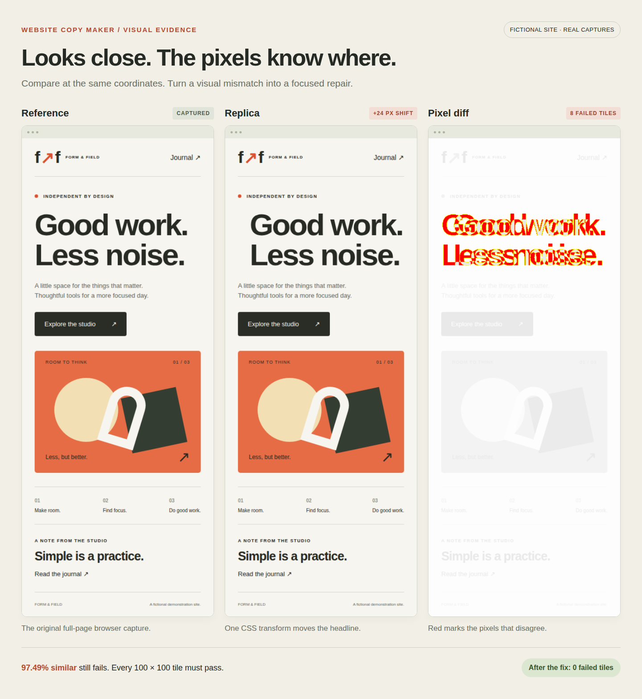
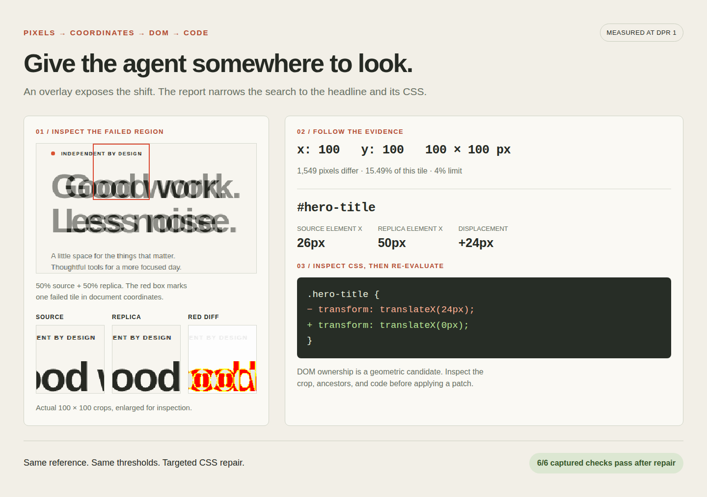

# website-copy-maker

**Copy the website. Let browser evidence guide the result.**

A provider-neutral toolkit for copying a website and its subpages. Capture
rendered structure, content, links, images, CSS backgrounds, and font references;
then evaluate any independently running copy with browser evidence.

[](https://scorecard.dev/viewer/?uri=github.com/intelligent-iterations/website-copy-maker)



_A real browser evaluation of a fictional demo. One 24px headline shift is enough
to fail individual tiles-even when the overall similarity looks good._

## Capture → build → evaluate → fix

The caller owns the resulting application. This package supplies screenshots,
measured geometry, interaction checks, copied asset facts, and focused repair
evidence. It has no model provider, database, hosting provider, or deployment
integration.

Clone the tagged source and build the CLI with Node.js 22 or newer and
pnpm 10.30.1:

```sh
git clone --branch v0.2.0 https://github.com/intelligent-iterations/website-copy-maker.git
cd website-copy-maker
pnpm install --frozen-lockfile
pnpm build
pnpm exec playwright install chromium

# Capture the source, including linked subpages.
node dist/cli.js capture --url https://example.com --out /work/reference-01

# Build and start your replica using your chosen stack, then evaluate it.
node dist/cli.js evaluate --reference /work/reference-01 \
  --url http://127.0.0.1:3000 --out /work/evaluation-01
```

**Agents: start with [the reconstruction workflow](docs/agent-workflow.md).**
Capture every agreed route, viewport, and interaction state; inspect the source;
implement; then use each evaluation to investigate and fix the remaining errors
until the captured scope passes or the agreed budget is reached.

Run browser work and builds in an isolated runtime with an explicit resource
budget. Each output directory must be new and outside package source. Run state
is caller-owned: no database, hidden home directory, or model API client.
Evaluation never overwrites your implementation or a previous run.

## From a red pixel to a code edit



The useful output is **where to look next**. `evaluation.json` includes failed
tiles in document coordinates, source/replica/diff crops, DOM candidates, computed
styles, ancestors, selectors, and optional `data-source-file` hints.

1. **Inspect the red crop.** Overlay source and replica at the same origin to
   expose shifts, wrapping, missing content, or incorrect assets.
2. **Follow the coordinates.** Compare the candidate element and its ancestors
   with the actual component and CSS. DOM ownership is a geometric hypothesis.
3. **Fix and re-evaluate.** Keep the reference and thresholds unchanged; let the
   next report guide the next targeted edit.

The demo repairs one deliberate CSS error, then verifies both routes, mobile
and desktop views, journal navigation, and an open dialog.
[Run the example yourself](docs/demo/README.md).

## Appearance and behavior

| Evidence                      | What it tells the agent                                                  |
| ----------------------------- | ------------------------------------------------------------------------ |
| Full-page screenshots         | Content, layout, typography, assets, and responsive differences          |
| Red diffs + 100×100 tiles     | Exactly which document regions fail the visual gate                      |
| Crops + DOM facts             | The local screenshot context, candidate elements, styles, and ancestors  |
| Links + interaction scenarios | Whether observed destinations and asserted UI states survive the rebuild |

Every 100×100 tile must have **at most 4% mismatched pixels**. Overall similarity
is informational. Comparisons preserve original document pixels at DPR 1;
missing or extra page area counts as a mismatch. All tiles are reported, with
crops for up to 30 worst failed tiles per comparison.

Capture follows same-origin links within the source URL's path scope. Add
`--path /blog/ /contact/` for explicit routes and `--max-pages 24` for the crawl
bound (maximum 64). Review omitted or inaccessible routes before calling it done.

Pass `--scenarios scenarios.json` to capture and replay clicks, menus, dialogs,
and other asserted states. [See scenario examples](docs/agent-workflow.md#2-understand-what-the-pages-do).
Screenshots suggest what a control does; browser assertions verify it.

CLI exit code `0` means the captured scope passed; `1` means a check, capture, or
coverage limit failed. Unspecified interactions remain unverified. Downloads,
popups, authentication, and backend effects need additional evidence. Inspect
visible issues even when they fall within the pixel tolerance.

<details>
<summary><strong>TypeScript API and optional generator</strong></summary>

To use the API in another project, run `pnpm pack` after building, then install
the resulting `website-copy-maker-0.2.0.tgz` in that project:

```sh
npm install /path/to/website-copy-maker-0.2.0.tgz
```

Import the installed package:

```ts
import { captureReference, evaluateReplica } from "website-copy-maker";

await captureReference({
  url: "https://example.com",
  outDir: "/work/reference-01",
  maxPages: 24,
});
const report = await evaluateReplica({
  referenceDir: "/work/reference-01",
  url: "http://127.0.0.1:3000",
  outDir: "/work/evaluation-01",
});
```

The package root also exports `compareScreenshots`, `findElementForRegion`, and
reference/scenario types. The optional `website-copy-maker/next-tailwind`
subpath provides a Next.js/Tailwind output adapter with an injected server
lifecycle and explicit `stateRoot`.

```ts
import { copyToNextTailwind } from "website-copy-maker/next-tailwind";
```

```sh
pnpm website-copy copy --adapter next-tailwind \
  --url https://example.com --out /work/generated-01 \
  --state-dir /work/generation-runs --max-iterations 6
```

The adapter copies materialized assets and discovered web-font files into its
output, installs that project's dependencies, and starts it for QA. It does not
deploy, configure hosting, or select a cloud provider. Modes: `responsive`
(default), `hybrid`, `semantic`, and `exact`. It is a starting point;
interaction fidelity still requires the workflow.

To bound source traffic, one capture or copy invocation makes at most 24
supplemental stylesheet requests (512 KiB each, 4 MiB total). A copy also
materializes at most 512 unique assets (10 MiB each, 100 MiB total). Fetches are
sequential, have no automatic retries, and follow at most two redirects. These
are per-run ceilings; the package starts no recurring work. Copy only content
you are authorized to reproduce, including licensed font and media files.

</details>

## Development

Early framework. Public release and distribution use a separate audited export.
The package includes the portable agent workflow and README illustrations.

Fast checks: `pnpm lint`, `pnpm test:unit`, `pnpm check:instructions`.
Isolated runtime checks: `pnpm test:integration`, `pnpm build`, and packed-package
CLI/API smoke verification. [Illustration capture recipe](docs/demo/README.md).

[Contributing](CONTRIBUTING.md) · [Security](SECURITY.md) · [MIT](LICENSE) © Intelligent Iterations
